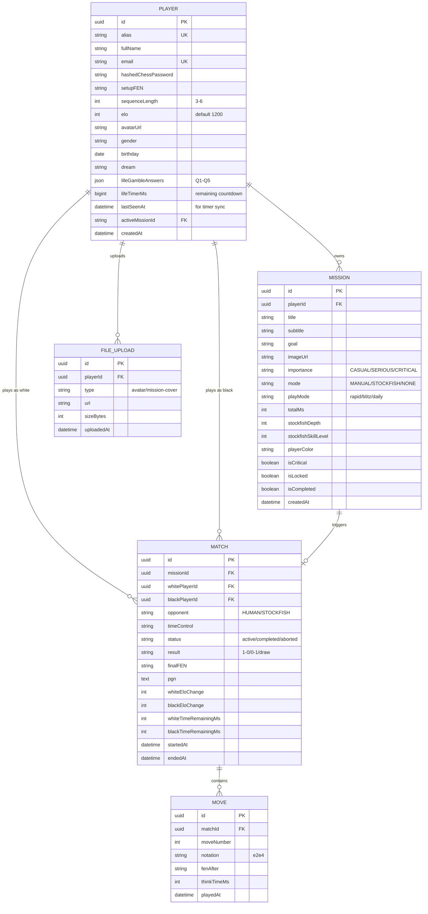

# Chess Commander: Backend System Architecture Plan (Final)

> เวอร์ชันสุดท้ายหลังตรวจทุกโมดูลบน Frontend ครบทั้ง 14 จุด

---

## 1. Technical Stack

| Layer | Technology | Why |
|---|---|---|
| **Framework** | NestJS (TypeScript) | โครงสร้างเหมือน Angular (Module/Service/DI) แชร์ Type ได้ |
| **Database** | PostgreSQL + Prisma ORM | Relational, รองรับ JSON columns สำหรับ Life Gamble answers |
| **Real-time** | Socket.io (via `@nestjs/websockets`) | Matchmaking + Live board sync |
| **Cache/Queue** | Redis | Active game state, matchmaking queue, session store |
| **Auth** | JWT (`@nestjs/jwt`) + bcrypt | Stateless auth tokens |
| **File Storage** | Local (multer) → AWS S3 (production) | Cover images, avatars |
| **Stockfish** | Self-hosted Stockfish binary or proxy | ลดการพึ่งพา external API |

---

## 2. Module-by-Module Audit

> ✅ = ครอบคลุมแล้ว, ⚠️ = ต้องเพิ่มใน backend, 🔴 = ข้อมูลหายเมื่อ refresh

### A. `login/` — Login Landing
| Item | สถานะปัจจุบัน | Backend ที่ต้องทำ |
|---|---|---|
| `loginState` flow | Client-side only (landing → form → password → success) | ไม่ต้องเก็บ state แต่ต้องมี API ✅ |
| Navigate to `/dashboard` | ไม่มี token — ใครก็เข้าได้ | ⚠️ ต้องมี AuthGuard + JWT |

### B. `autograph-longin/` — Alias Input (Step 1 of Login)
| Item | สถานะปัจจุบัน | Backend ที่ต้องทำ |
|---|---|---|
| `playerName` | emit ไปให้ password-login — **ไม่ validate กับ DB** | ⚠️ `POST /auth/lookup` → ตรวจว่า alias มีอยู่จริง แล้วส่ง `setupFEN` กลับ |
| New Player button | `router.navigate(['/register'])` | ✅ ไม่ต้องแก้ |

### C. `password-login/` — Chess Password (Step 2 of Login)
| Item | สถานะปัจจุบัน | Backend ที่ต้องทำ |
|---|---|---|
| `passwordSequence` | 🔴 **Hardcoded** `["N:f3e5", "n:c6e5", "n:f6e4"]` | ⚠️ ต้อง fetch จาก DB หลัง lookup |
| Initial FEN | 🔴 **Hardcoded** `"r1bqkb1r/pppp1ppp/..."` | ⚠️ ส่งมาจาก `/auth/lookup` response |
| `validateSequence()` | เปรียบเทียบ plain text ฝั่ง client | ⚠️ ต้องส่ง sequence ไป `POST /auth/login` ให้ server hash + compare |

### D. `register/` — Registration Profile
| Item | สถานะปัจจุบัน | Backend ที่ต้องทำ |
|---|---|---|
| `profile.fullName` | 🔴 `console.log` แล้ว navigate ต่อ | ⚠️ `POST /auth/register/profile` |
| `profile.nickname` (alias) | 🔴 ไม่ได้เก็บ | ⚠️ UNIQUE constraint ใน DB |
| `profile.age` | 🔴 | ⚠️ เก็บเป็น birthday (date) |
| `profile.gender` | 🔴 | ⚠️ enum ใน DB |
| `profile.goals` (Dream) | 🔴 | ⚠️ `lifeGambleAnswers` JSON column |
| `profile.answers` (Q1-Q5) | 🔴 5 คำถาม Life Gamble ไม่ได้เก็บที่ไหนเลย | ⚠️ `lifeGambleAnswers` JSON column |

### E. `register-password/` — Chess Password Setup
| Item | สถานะปัจจุบัน | Backend ที่ต้องทำ |
|---|---|---|
| `setupFEN` (board position) | 🔴 อยู่ใน `fenInput` variable | ⚠️ `POST /auth/register/password` → save FEN |
| `moveSequence` | 🔴 อยู่ใน `userEnteredMoves` array | ⚠️ Hash ด้วย bcrypt แล้วเก็บ |
| `sequenceLength` (3-6) | Client preference | ⚠️ เก็บเพื่อใช้ตอน login (บอก client ว่าต้องเดินกี่ตา) |

### F. `dashboard/life-timer/` — Life Countdown Timer
| Item | สถานะปัจจุบัน | Backend ที่ต้องทำ |
|---|---|---|
| `totalMs` | 🔴 เก็บใน **localStorage** เท่านั้น → เปลี่ยนเครื่อง/ลบ cache = หาย | ⚠️ `PLAYER.lifeTimerMs` column ใน DB — sync ทุกครั้งที่เข้า dashboard |
| `LAST_TIME_KEY` | ใช้คำนวณเวลาที่ผ่านไปตอนปิดแอป | ⚠️ Server ตรวจ `lastSeenAt` timestamp แล้วคำนวณให้ |
| Default `83219:59:59.999` | Hardcoded | ⚠️ ควรเก็บค่าเริ่มต้นตอน register |

### G. `dashboard/game-carousel/` + `mission.service.ts`
| Item | สถานะปัจจุบัน | Backend ที่ต้องทำ |
|---|---|---|
| Mission list | 🔴 **BehaviorSubject** ใน memory — refresh แล้วกลับเป็น default 5 ตัว | ⚠️ `GET /missions` → fetch จาก DB |
| Active mission | 🔴 `activeMissionId$` BehaviorSubject | ⚠️ `PATCH /players/me` → save activeMissionId |
| Mission data | id, title, subtitle, timer, imageUrl, isCritical, isLocked, totalMs, playMode | ⚠️ ทั้งหมดต้องเก็บใน `MISSION` table |

### H. `dashboard/header/new_game/`
| Item | สถานะปัจจุบัน | Backend ที่ต้องทำ |
|---|---|---|
| Cover image upload | 🔴 `FileReader.readAsDataURL` → base64 ใน memory | ⚠️ `POST /uploads/image` → multer → S3 → return URL |
| Game config | gameName, importance, goal, timeValues, playMode | ⚠️ `POST /missions` → save to DB |
| Stockfish config | depth, skillLevel, playerColor | ⚠️ เก็บใน mission record สำหรับ resume |

### I. `chess-board/` + `chess-board.service.ts`
| Item | สถานะปัจจุบัน | Backend ที่ต้องทำ |
|---|---|---|
| `chessBoardState$` | BehaviorSubject ของ FEN — reset ตอน ngOnDestroy | ⚠️ Multiplayer: sync ผ่าน Socket.io room |
| `gameTimeMs$` | BehaviorSubject `300000` default | ⚠️ Server-authoritative timer (ป้องกัน cheat) |
| Timer logic | `setInterval` ฝั่ง client — **client สามารถแก้เวลาได้** | ⚠️ Server ต้องเป็นคนจับเวลาจริงๆ |
| Game history | `gameHistory[]` ใน memory | ⚠️ `MOVE` table + PGN column ใน `MATCH` |
| Move sounds | `assets/sound/*.mp3` | ✅ Client-side only — ไม่ต้อง backend |
| Flip board | `flipMode` boolean | ✅ Client-side UI preference |

### J. `computer-mode/` + `stockfish.service.ts`
| Item | สถานะปัจจุบัน | Backend ที่ต้องทำ |
|---|---|---|
| API endpoint | 🔴 **Direct call** ไป `stockfish.online/api/s/v2.php` จาก Angular | ⚠️ `POST /stockfish/best-move` → Backend proxy |
| `computerConfiguration$` | BehaviorSubject: color + level + depth | ⚠️ เก็บใน Mission record + ส่งผ่าน proxy |
| Game result vs AI | 🔴 ไม่ได้เก็บ | ⚠️ บันทึกเป็น MATCH record (opponent = "STOCKFISH") |

### K. `move-list/`
| Item | สถานะปัจจุบัน | Backend ที่ต้องทำ |
|---|---|---|
| MoveList display | Purely presentational (Input from chess-board) | ✅ UI only — data มาจาก game history |
| Move navigation | Arrow keys + click → `showPreviousPosition` | ✅ Client-side |

### L. `nav-menu/`
| Item | สถานะปัจจุบัน | Backend ที่ต้องทำ |
|---|---|---|
| Menu visibility | แสดงเสมอ — ไม่มีแนวคิด logged in/out | ⚠️ ต้องซ่อนเมนูถ้าไม่ได้ login |
| PlayAgainstComputerDialog | เปิด Dialog เลือก level + color | ✅ Client-side interaction |

### M. `dashboard/footer/`
| Item | สถานะปัจจุบัน | Backend ที่ต้องทำ |
|---|---|---|
| PLAY button | Emit `playAction` → Dashboard orchestrates | ✅ Logic อยู่ที่ Dashboard |
| Records button | ⚠️ ไม่มีการทำงาน (placeholder) | ⚠️ ต้อง wire กับ `GET /matches?playerId=me` |

---

## 3. Database Schema (Final)



---

## 4. API Endpoints (Complete)

### Auth
```
POST /auth/lookup          → { alias } → { exists, setupFEN, sequenceLength }
POST /auth/login           → { alias, moveSequence } → { accessToken }
POST /auth/register/profile → { fullName, alias, birthday, gender, dream, answers }
POST /auth/register/password → { setupFEN, moveSequence, sequenceLength }
```

### Player
```
GET    /players/me              → Player profile
PATCH  /players/me              → Update profile / activeMissionId
GET    /players/me/timer        → { lifeTimerMs, lastSeenAt }
PATCH  /players/me/timer        → Sync lifeTimerMs from client
GET    /players/:id/stats       → Elo, wins, losses, total games
GET    /players/leaderboard     → Top N by Elo
```

### Mission
```
GET    /missions                → List player's missions
POST   /missions                → Create new mission (from New Game modal)
PATCH  /missions/:id            → Update status / mark complete
DELETE /missions/:id            → Delete mission
```

### Match
```
GET    /matches?playerId=me     → Match history (paginated)
GET    /matches/:id             → Full match detail + PGN
POST   /matches                 → Create match record (on game start)
PATCH  /matches/:id             → Update result / status
```

### Stockfish Proxy
```
POST   /stockfish/best-move     → { fen, depth } → { bestMove }
```

### File Upload
```
POST   /uploads/image           → multipart/form-data → { url }
```

### Socket.io Events (Game Room)
```
Client → Server:
  join-queue       → { playerId, elo, timeControl }
  make-move        → { matchId, from, to, promotion? }
  resign           → { matchId }
  offer-draw       → { matchId }
  accept-draw      → { matchId }

Server → Client:
  match-found      → { matchId, opponent, color }
  move-validated   → { matchId, move, newFEN, timeWhite, timeBlack }
  move-rejected    → { reason }
  game-over        → { result, eloChange }
  timer-sync       → { whiteMs, blackMs }
```

---

## 5. Route Guards (Frontend)

```
Public Routes (ไม่ต้อง login):
  /              → LoginComponent
  /register      → RegisterComponent
  /register-password → RegisterPasswordComponent

Protected Routes (ต้อง JWT):
  /dashboard     → DashboardComponent
  /against-friend → ChessBoardComponent
  /against-computer → ComputerModeComponent
```

---

## 6. Frontend Changes Required

| File | Action | Detail |
|---|---|---|
| **NEW** `auth.service.ts` | สร้างใหม่ | จัดการ login/register/logout, เก็บ JWT |
| **NEW** `auth.guard.ts` | สร้างใหม่ | CanActivate guard สำหรับ protected routes |
| **NEW** `auth.interceptor.ts` | สร้างใหม่ | แนบ `Authorization: Bearer <token>` ทุก request |
| `password-login.component.ts` | แก้ | ลบ hardcoded FEN + sequence → fetch จาก `/auth/lookup` |
| `register.component.ts` | แก้ | `onSubmit()` → call `POST /auth/register/profile` |
| `register-password.component.ts` | แก้ | `confirmFinalPassword()` → call `POST /auth/register/password` |
| `mission.service.ts` | แก้ | BehaviorSubject → sync กับ REST `/missions` |
| `life-timer.service.ts` | แก้ | localStorage → sync กับ `/players/me/timer` |
| `stockfish.service.ts` | แก้ | URL เปลี่ยนจาก `stockfish.online` → `/stockfish/best-move` |
| `chess-board.service.ts` | แก้ | เพิ่ม Socket.io connection สำหรับ multiplayer |
| `new-game.component.ts` | แก้ | Cover image → upload ผ่าน `/uploads/image` |
| `app-routing.module.ts` | แก้ | เพิ่ม `canActivate: [AuthGuard]` ใน protected routes |

---

## 7. Environment & Deployment

| Environment | Database | Redis | Stockfish |
|---|---|---|---|
| **Local Dev** | PostgreSQL via Docker | Redis via Docker | `stockfish.online` (temporary) |
| **Staging** | Managed PostgreSQL (Railway/Supabase) | Managed Redis (Upstash) | WASM in Docker |
| **Production** | Managed PostgreSQL + read replicas | Redis Cluster | Dedicated Stockfish server |

---

## 8. Implementation Roadmap

```
Phase 1 — Foundation (Week 1)
├── Initialize NestJS project in "Chess Commander BE"
├── Setup PostgreSQL + Prisma → migrate schema
├── Auth Module (register profile + register password + lookup + login + JWT)
└── Wire Angular registration + login → real API calls

Phase 2 — Core Features (Week 2)
├── Player Profile endpoints (GET/PATCH /players/me)
├── Life Timer server sync (GET/PATCH /players/me/timer)
├── Mission CRUD (replace client BehaviorSubject → REST)
├── File upload service (multer → S3)
└── Frontend AuthGuard + HttpInterceptor

Phase 3 — Game Engine (Week 3)
├── Socket.io gateway setup
├── Matchmaking queue (Redis sorted set by Elo)
├── Server-side move validation (chess.js)
├── Server-authoritative timer (prevent cheats)
├── Move history persistence (MOVE table + PGN)
└── Game result → Elo calculation

Phase 4 — Polish (Week 4)
├── Stockfish proxy service
├── Leaderboard + player stats
├── Daily chess cron jobs
├── Records button functionality (match history list)
└── Nav-menu auth-aware visibility
```
