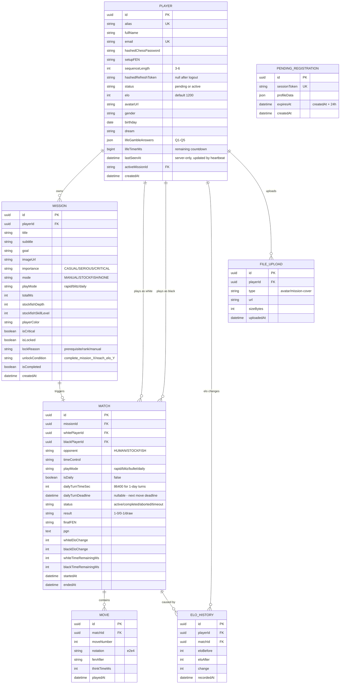

# Chess Commander: Backend System Architecture Plan (v3 — Final)

> เวอร์ชันสุดท้าย หลัง Code Review รอบที่ 3 — แก้ Registration Atomicity, Heartbeat Multi-tab, Daily Chess Cron, Mission Unlock Logic, Stockfish Validation, Testing Strategy ครบ

---

## 1. Technical Stack

| Layer | Technology | Why |
|---|---|---|
| **Framework** | NestJS (TypeScript) | โครงสร้างเหมือน Angular (Module/Service/DI) แชร์ Type ได้ |
| **Database** | PostgreSQL + Prisma ORM | Relational, รองรับ JSON columns สำหรับ Life Gamble answers |
| **Real-time** | Socket.io (via `@nestjs/websockets`) | Matchmaking + Live board sync |
| **Cache/Queue** | Redis | Active game state, matchmaking queue, session store |
| **Auth** | JWT (`@nestjs/jwt`) + bcrypt | Access + Refresh token pair |
| **Rate Limiting** | `@nestjs/throttler` | ป้องกัน brute force chess password |
| **File Storage** | Local (multer) → AWS S3 (production) | Cover images, avatars |
| **Stockfish** | Self-hosted Stockfish binary or proxy (timeout 10s, fallback to `stockfish.online`) | ลดการพึ่งพา external API |

---

## 1.1 Security Layer

### Rate Limiting
| Endpoint | Limit | Reason |
|---|---|---|
| `POST /auth/login` | **5 req/min** per IP | ป้องกัน brute force chess password |
| `POST /auth/lookup` | **10 req/min** per IP | ป้องกัน alias enumeration |
| `POST /auth/register/*` | **3 req/min** per IP | ป้องกัน spam registration |
| อื่นๆ ทุก endpoint | **60 req/min** per user | General abuse prevention |

```typescript
// NestJS implementation
@Module({
  imports: [ThrottlerModule.forRoot([{ ttl: 60000, limit: 60 }])],
})
// Per-route override:
@Throttle({ default: { ttl: 60000, limit: 5 } })
@Post('login')
async login() { ... }
```

### Refresh Token Flow
```
1. POST /auth/login → { accessToken (15min), refreshToken (7d) }
2. refreshToken เก็บใน httpOnly cookie (ไม่ให้ JS เข้าถึง)
3. accessToken เก็บใน memory (BehaviorSubject ใน AuthService)
4. เมื่อ accessToken expire → POST /auth/refresh → { newAccessToken }
5. เมื่อ refreshToken expire → Redirect ไป login ใหม่
6. POST /auth/logout → Invalidate refreshToken ใน DB
```

| Token | Storage | TTL | Purpose |
|---|---|---|---|
| `accessToken` | Memory (Angular BehaviorSubject) | 15 min | API authorization |
| `refreshToken` | httpOnly cookie + hashed in DB | 7 days | Silent re-auth |

### CORS Configuration
```typescript
// main.ts
app.enableCors({
  origin: [
    'http://localhost:4200',          // Angular dev
    'https://chess-commander.app',    // Production
  ],
  credentials: true,                  // สำหรับ httpOnly cookie
  methods: ['GET', 'POST', 'PATCH', 'DELETE'],
});
```

---

## 1.2 Error Handling Strategy

ทุก API response ใช้ format เดียวกันหมด:

```typescript
// Success
{
  "success": true,
  "data": { ... },
  "meta": { "timestamp": "2026-04-08T14:00:00Z" }
}

// Error
{
  "success": false,
  "error": {
    "code": "AUTH_INVALID_SEQUENCE",
    "message": "Chess password sequence is incorrect.",
    "statusCode": 401
  },
  "meta": { "timestamp": "2026-04-08T14:00:00Z" }
}
```

**Error Code Catalog:**
| Code | HTTP | When |
|---|---|---|
| `AUTH_ALIAS_NOT_FOUND` | 404 | Alias ไม่มีในระบบ |
| `AUTH_INVALID_SEQUENCE` | 401 | Chess password ไม่ถูก |
| `AUTH_RATE_LIMITED` | 429 | ส่ง request เกิน limit |
| `AUTH_TOKEN_EXPIRED` | 401 | JWT หมดอายุ |
| `AUTH_ALIAS_TAKEN` | 409 | Alias ซ้ำตอน register |
| `GAME_ILLEGAL_MOVE` | 400 | Move ผิดกฎ (server validated) |
| `GAME_NOT_YOUR_TURN` | 403 | เดินไม่ใช่ตาของตัวเอง |
| `GAME_ROOM_EXPIRED` | 410 | ห้องเกมหมดอายุ |
| `STOCKFISH_TIMEOUT` | 504 | Stockfish ไม่ตอบภายใน 10s |
| `UPLOAD_TOO_LARGE` | 413 | ไฟล์เกิน 5MB |

NestJS implementation ใช้ Global Exception Filter:
```typescript
@Catch()
export class GlobalExceptionFilter implements ExceptionFilter {
  catch(exception: unknown, host: ArgumentsHost) {
    // Normalize all errors to { success, error, meta } format
  }
}
```

---

## 2. Module-by-Module Audit

> ✅ = ครอบคลุมแล้ว, ⚠️ = ต้องเพิ่มใน backend, 🔴 = ข้อมูลหายเมื่อ refresh

### A. `login/` — Login Landing
| Item | สถานะปัจจุบัน | Backend ที่ต้องทำ |
|---|---|---|
| `loginState` flow | Client-side only (landing → form → password → success) | ไม่ต้องเก็บ state แต่ต้องมี API ✅ |
| Navigate to `/dashboard` | ไม่มี token — ใครก็เข้าได้ | ⚠️ ต้องมี AuthGuard + JWT |

### B. `autograph-longin/` — Alias Input (Step 1 of Login)
| Item | สถานะปัจจุบัน | Backend ที่ต้องทำ |
|---|---|---|
| `playerName` | emit ไปให้ password-login — **ไม่ validate กับ DB** | ⚠️ `POST /auth/lookup` → ตรวจว่า alias มีอยู่จริง แล้วส่ง `setupFEN` กลับ |
| New Player button | `router.navigate(['/register'])` | ✅ ไม่ต้องแก้ |

### C. `password-login/` — Chess Password (Step 2 of Login)
| Item | สถานะปัจจุบัน | Backend ที่ต้องทำ |
|---|---|---|
| `passwordSequence` | 🔴 **Hardcoded** `["N:f3e5", "n:c6e5", "n:f6e4"]` | ⚠️ ต้อง fetch จาก DB หลัง lookup |
| Initial FEN | 🔴 **Hardcoded** `"r1bqkb1r/pppp1ppp/..."` | ⚠️ ส่งมาจาก `/auth/lookup` response |
| `validateSequence()` | เปรียบเทียบ plain text ฝั่ง client | ⚠️ ต้องส่ง sequence ไป `POST /auth/login` ให้ server hash + compare |

### D. `register/` — Registration Profile
| Item | สถานะปัจจุบัน | Backend ที่ต้องทำ |
|---|---|---|
| `profile.fullName` | 🔴 `console.log` แล้ว navigate ต่อ | ⚠️ `POST /auth/register/profile` |
| `profile.nickname` (alias) | 🔴 ไม่ได้เก็บ | ⚠️ UNIQUE constraint ใน DB |
| `profile.age` | 🔴 | ⚠️ เก็บเป็น birthday (date) |
| `profile.gender` | 🔴 | ⚠️ enum ใน DB |
| `profile.email` | 🔴 **ไม่มี input field เลยใน register form** | ⚠️ ต้องเพิ่ม email field ใน `register.component.html` — collect ตอน register เลย |
| `profile.goals` (Dream) | 🔴 | ⚠️ `lifeGambleAnswers` JSON column |
| `profile.answers` (Q1-Q5) | 🔴 5 คำถาม Life Gamble ไม่ได้เก็บที่ไหนเลย | ⚠️ `lifeGambleAnswers` JSON column |

### E. `register-password/` — Chess Password Setup
| Item | สถานะปัจจุบัน | Backend ที่ต้องทำ |
|---|---|---|
| `setupFEN` (board position) | 🔴 อยู่ใน `fenInput` variable | ⚠️ `POST /auth/register/password` → save FEN |
| `moveSequence` | 🔴 อยู่ใน `userEnteredMoves` array | ⚠️ Hash ด้วย bcrypt แล้วเก็บ |
| `sequenceLength` (3-6) | Client preference | ⚠️ เก็บเพื่อใช้ตอน login (บอก client ว่าต้องเดินกี่ตา) |

### F. `dashboard/life-timer/` — Life Countdown Timer
| Item | สถานะปัจจุบัน | Backend ที่ต้องทำ |
|---|---|---|
| `totalMs` | 🔴 เก็บใน **localStorage** เท่านั้น → เปลี่ยนเครื่อง/ลบ cache = หาย | ⚠️ `PLAYER.lifeTimerMs` column ใน DB — sync ทุกครั้งที่เข้า dashboard |
| `LAST_TIME_KEY` | ใช้คำนวณเวลาที่ผ่านไปตอนปิดแอป | ⚠️ Server ตรวจ `lastSeenAt` timestamp แล้วคำนวณให้ |
| Default `83219:59:59.999` | Hardcoded | ⚠️ ควรเก็บค่าเริ่มต้นตอน register |

> **🔒 Security Fix — Life Timer:**
> ~~`PATCH /players/me/timer` ที่ให้ client ส่ง `lifeTimerMs` มาเอง~~ ❌ **ลบออก**
>
> Client **ไม่ส่งค่า timer** ตรงๆ มาอีกต่อไป เปลี่ยนเป็น:
> ```
> GET /players/me/timer   → Server คำนวณ:
>   remainingMs = savedLifeTimerMs - (now - lastSeenAt)
>   return { lifeTimerMs: remainingMs }
>
> POST /players/me/heartbeat  → Server อัพเดท lastSeenAt = now
>   (Frontend เรียกทุก 60 วินาที ขณะ dashboard เปิดอยู่)
> ```
> **ผลลัพธ์:** Client ไม่สามารถส่งค่าเวลาเท่าไหร่ก็ได้มาอีกต่อไป server เป็นคนคำนวณเองทั้งหมด

### G. `dashboard/game-carousel/` + `mission.service.ts`
| Item | สถานะปัจจุบัน | Backend ที่ต้องทำ |
|---|---|---|
| Mission list | 🔴 **BehaviorSubject** ใน memory — refresh แล้วกลับเป็น default 5 ตัว | ⚠️ `GET /missions` → fetch จาก DB |
| Active mission | 🔴 `activeMissionId$` BehaviorSubject | ⚠️ `PATCH /players/me` → save activeMissionId |
| Mission data | id, title, subtitle, timer, imageUrl, isCritical, isLocked, totalMs, playMode | ⚠️ ทั้งหมดต้องเก็บใน `MISSION` table |

### H. `dashboard/header/new_game/`
| Item | สถานะปัจจุบัน | Backend ที่ต้องทำ |
|---|---|---|
| Cover image upload | 🔴 `FileReader.readAsDataURL` → base64 ใน memory | ⚠️ `POST /uploads/image` → multer → S3 → return URL |
| Game config | gameName, importance, goal, timeValues, playMode | ⚠️ `POST /missions` → save to DB |
| Stockfish config | depth, skillLevel, playerColor | ⚠️ เก็บใน mission record สำหรับ resume |

### I. `chess-board/` + `chess-board.service.ts`
| Item | สถานะปัจจุบัน | Backend ที่ต้องทำ |
|---|---|---|
| `chessBoardState$` | BehaviorSubject ของ FEN — reset ตอน ngOnDestroy | ⚠️ Multiplayer: sync ผ่าน Socket.io room |
| `gameTimeMs$` | BehaviorSubject `300000` default | ⚠️ Server-authoritative timer (ป้องกัน cheat) |
| Timer logic | `setInterval` ฝั่ง client — **client สามารถแก้เวลาได้** | ⚠️ Server ต้องเป็นคนจับเวลาจริงๆ |
| Game history | `gameHistory[]` ใน memory | ⚠️ `MOVE` table + PGN column ใน `MATCH` |
| Move sounds | `assets/sound/*.mp3` | ✅ Client-side only — ไม่ต้อง backend |
| Flip board | `flipMode` boolean | ✅ Client-side UI preference |

### J. `computer-mode/` + `stockfish.service.ts`
| Item | สถานะปัจจุบัน | Backend ที่ต้องทำ |
|---|---|---|
| API endpoint | 🔴 **Direct call** ไป `stockfish.online/api/s/v2.php` จาก Angular | ⚠️ `POST /stockfish/best-move` → Backend proxy |
| `computerConfiguration$` | BehaviorSubject: color + level + depth | ⚠️ เก็บใน Mission record + ส่งผ่าน proxy |
| Game result vs AI | 🔴 ไม่ได้เก็บ | ⚠️ บันทึกเป็น MATCH record (opponent = "STOCKFISH") |

### K. `move-list/`
| Item | สถานะปัจจุบัน | Backend ที่ต้องทำ |
|---|---|---|
| MoveList display | Purely presentational (Input from chess-board) | ✅ UI only — data มาจาก game history |
| Move navigation | Arrow keys + click → `showPreviousPosition` | ✅ Client-side |

### L. `nav-menu/`
| Item | สถานะปัจจุบัน | Backend ที่ต้องทำ |
|---|---|---|
| Menu visibility | แสดงเสมอ — ไม่มีแนวคิด logged in/out | ⚠️ ต้องซ่อนเมนูถ้าไม่ได้ login |
| PlayAgainstComputerDialog | เปิด Dialog เลือก level + color | ✅ Client-side interaction |

### M. `dashboard/footer/`
| Item | สถานะปัจจุบัน | Backend ที่ต้องทำ |
|---|---|---|
| PLAY button | Emit `playAction` → Dashboard orchestrates | ✅ Logic อยู่ที่ Dashboard |
| Records button | ⚠️ ไม่มีการทำงาน (placeholder) | ⚠️ ต้อง wire กับ `GET /matches?playerId=me` |

---

## 3. Database Schema (Revised)



---

## 3.1 Registration Atomicity Design

2-step registration มีความเสี่ยงที่ user จะทำ Step 1 แล้ว**ปิดแอปก่อน Step 2** ทำให้มี record กึ่งสำเร็จค้างใน DB

**แนวทางที่เลือก — Session Token ชั่วคราว:**
```
Step 1: POST /auth/register/profile
  → ไม่ insert ลง PLAYER table เลย
  → insert ลง PENDING_REGISTRATION table แทน
  → return { sessionToken } (expires in 24h)

Step 2: POST /auth/register/password
  → รับ { sessionToken, setupFEN, moveSequence, sequenceLength }
  → อ่าน profileData จาก PENDING_REGISTRATION
  → Atomic: insert PLAYER + delete PENDING_REGISTRATION ใน DB transaction เดียว
  → ถ้า sessionToken expire → error AUTH_SESSION_EXPIRED
```

**Cron Cleanup** (ทุก 1 ชั่วโมง):
```typescript
@Cron('0 * * * *')
async cleanPendingRegistrations() {
  await prisma.pendingRegistration.deleteMany({
    where: { expiresAt: { lt: new Date() } }
  });
}
```

> เพิ่ม Error Code: `AUTH_SESSION_EXPIRED` (410) — sessionToken หมดอายุ ต้องเริ่มต้น register ใหม่

---

## 4. API Endpoints (Complete)

### Auth
```
POST /auth/lookup          → { alias } → { exists, setupFEN, sequenceLength }
POST /auth/login           → { alias, moveSequence } → { accessToken } + httpOnly refreshToken cookie
POST /auth/refresh         → (reads httpOnly cookie) → { accessToken }
POST /auth/logout          → Invalidate refreshToken in DB + clear cookie
POST /auth/register/profile  → { fullName, alias, email, birthday, gender, dream, answers } → { sessionToken }
POST /auth/register/password → { sessionToken, setupFEN, moveSequence, sequenceLength } → { accessToken } + httpOnly cookie
```

### Player
```
GET    /players/me              → Player profile
PATCH  /players/me              → Update profile / activeMissionId
GET    /players/me/timer        → { lifeTimerMs } (server-calculated, NOT client-submitted)
POST   /players/me/heartbeat   → Server updates lastSeenAt via upsert (safe for multiple tabs — always takes latest timestamp)

> **🔍 Multi-tab Safety:** heartbeat ใช้ upsert บน `lastSeenAt` ได้เลย ไม่มีปัญหา race condition แต่ Life Timer คำนวณจาก **session เดียว** คือ `GET /players/me/timer` คืนค่าเดียว ไม่ว่าจะมีกี่ tab เปิดอยู่ timer ยังคงจะจับเวลาเดินสัปดาห์เดียว
GET    /players/:id/stats       → Elo, wins, losses, total games
GET    /players/me/elo-history  → [{ matchId, eloBefore, eloAfter, change, date }]
GET    /players/leaderboard     → Top N by Elo
```

### Mission
```
GET    /missions                    → List player's missions
POST   /missions                    → Create new mission (from New Game modal)
PATCH  /missions/:id                → Update status / mark complete
DELETE /missions/:id                → Delete mission
POST   /missions/:id/check-unlock   → Server evaluates unlockCondition → PATCH isLocked if met
```

### Match
```
GET    /matches?playerId=me     → Match history (paginated)
GET    /matches/:id             → Full match detail + PGN
POST   /matches                 → Create match record (on game start)
PATCH  /matches/:id             → Update result / status
```

### Stockfish Proxy
```
POST   /stockfish/best-move     → { fen, depth (max 20) } → { bestMove }
```

> **Input Validation (ก่อนส่งต่อให้ Stockfish binary):**
> - Validate `fen` format ด้วย regex / chess.js parser (ป้องกัน malformed FEN crash binary)
> - Cap `depth` ≤ 20 — ถ้า client ส่งมากกว่านี้ → clamp เป็น 20 อัตโนมัติ ไม่ throw error
> - ถ้า FEN invalid → return error `STOCKFISH_INVALID_FEN` (400) ทันที ไม่ส่งต่อ

### File Upload
```
POST   /uploads/image           → multipart/form-data → { url }
```

### Socket.io Events (Game Room)
```
Client → Server:
  join-queue       → { playerId, elo, timeControl }
  make-move        → { matchId, from, to, promotion? }
  resign           → { matchId }
  offer-draw       → { matchId }
  accept-draw      → { matchId }
  reconnect-game   → { matchId, playerId }           ← NEW

Server → Client:
  match-found      → { matchId, opponent, color }
  move-validated   → { matchId, move, newFEN, timeWhite, timeBlack }
  move-rejected    → { reason }
  game-over        → { result, eloChange }
  timer-sync       → { whiteMs, blackMs }
  reconnect-state  → { matchId, currentFEN, moves[], timeWhite, timeBlack }  ← NEW
  opponent-disconnected → { gracePeriodMs: 30000 }   ← NEW
  opponent-reconnected  → {}                          ← NEW
  opponent-forfeited    → { result }                  ← NEW
```

> **🔌 Disconnect / Reconnect Logic:**
> 1. Client disconnect → Server เริ่มจับเวลา **30 วินาที** grace period
> 2. ถ้า client กลับมาภายใน 30s → `reconnect-game` → server ส่ง `reconnect-state` กลับ → เล่นต่อ
> 3. ถ้าเกิน 30s → Server emit `opponent-forfeited` → auto-forfeit → update MATCH.result

---

## 5. Route Guards (Frontend)

```
Public Routes (ไม่ต้อง login):
  /              → LoginComponent
  /register      → RegisterComponent
  /register-password → RegisterPasswordComponent

Protected Routes (ต้อง JWT):
  /dashboard     → DashboardComponent
  /against-friend → ChessBoardComponent
  /against-computer → ComputerModeComponent
```

---

## 6. Frontend Changes Required

| File | Action | Detail |
|---|---|---|
| **NEW** `auth.service.ts` | สร้างใหม่ | จัดการ login/register/logout, เก็บ JWT |
| **NEW** `auth.guard.ts` | สร้างใหม่ | CanActivate guard สำหรับ protected routes |
| **NEW** `auth.interceptor.ts` | สร้างใหม่ | แนบ `Authorization: Bearer <token>` ทุก request |
| `password-login.component.ts` | แก้ | ลบ hardcoded FEN + sequence → fetch จาก `/auth/lookup` |
| `register.component.ts` | แก้ | `onSubmit()` → call `POST /auth/register/profile` |
| `register-password.component.ts` | แก้ | `confirmFinalPassword()` → call `POST /auth/register/password` |
| `mission.service.ts` | แก้ | BehaviorSubject → sync กับ REST `/missions` |
| `life-timer.service.ts` | แก้ | localStorage → sync กับ `/players/me/timer` |
| `stockfish.service.ts` | แก้ | URL เปลี่ยนจาก `stockfish.online` → `/stockfish/best-move` |
| `chess-board.service.ts` | แก้ | เพิ่ม Socket.io connection สำหรับ multiplayer |
| `new-game.component.ts` | แก้ | Cover image → upload ผ่าน `/uploads/image` |
| `app-routing.module.ts` | แก้ | เพิ่ม `canActivate: [AuthGuard]` ใน protected routes |

---

## 7. Daily Chess Mode Design

Daily Chess ต่างจาก Rapid/Blitz โดยสิ้นเชิง — เป็น **asynchronous** ไม่ใช้ real-time timer:

| Aspect | Rapid/Blitz | Daily Chess |
|---|---|---|
| Timer | Real-time countdown (ms) | Turn-based deadline (days) |
| State | Redis (volatile) | PostgreSQL (persistent) |
| Sync | Socket.io live | REST polling / Push notification |
| Timeout | Game over instantly | Cron job checks every 15 min |

### Daily Match Flow
```
1. POST /matches (playMode: "daily", dailyTurnTimeSec: 86400)
2. Player A makes move → PATCH /matches/:id/move
   → Server sets dailyTurnDeadline = now + 86400s
   → Notify Player B (push / email)
3. Player B opens app → GET /matches/:id → sees opponent's move
4. Player B makes move → cycle repeats
5. If deadline passes → Cron job: auto-forfeit
```

### Cron Job
```typescript
@Cron('*/15 * * * *') // Every 15 minutes
async checkDailyTimeouts() {
  const expired = await prisma.match.findMany({
    where: {
      isDaily: true,
      status: 'active',
      dailyTurnDeadline: { lt: new Date() }
    }
  });
  // Auto-forfeit expired matches
}
```

> **📧 Notification Scope — Daily Chess:**
> | สิ่ง | สถานะ Phase 4 |
> |---|---|
> | Push Notification (PWA/FCM) | ⭐ Nice to have |
> | Email Notification | ⭐ Nice to have |
> | In-app badge บน Dashboard | ✅ ควรทำตั้งแต่แรก |

---

## 8. Mission Lock/Unlock Business Logic

| `lockReason` | `unlockCondition` | Example |
|---|---|---|
| `prerequisite` | `complete_mission_8411` | ต้องเคลียร์ LOST HERITAGE ก่อน |
| `rank` | `reach_elo_1400` | ต้อง Elo ถึง 1400 |
| `manual` | Admin unlock | GM หรือ admin ปลดล็อคให้ |
| `null` | ไม่ล็อค | เล่นได้ทันที |

Server ตรวจ unlock condition และ auto-trigger **อัตโนมัติ** ทุกครั้งที่:
- Match จบ → `checkUnlockByElo(playerId, newElo)` → PATCH `isLocked = false` ถ้า condition ตรง
- Mission completed → `checkUnlockByPrerequisite(playerId, missionId)` → PATCH `isLocked = false`

`POST /missions/:id/check-unlock` ไว้เป็น **manual trigger** สำหรับ admin หรือ debug เพิ่มเติมเท่านั้น

---

## 9. Environment & Deployment

| Environment | Database | Redis | Stockfish |
|---|---|---|---|
| **Local Dev** | PostgreSQL via Docker | Redis via Docker | `stockfish.online` (temporary) |
| **Staging** | Managed PostgreSQL (Railway/Supabase) | Managed Redis (Upstash) | WASM in Docker |
| **Production** | Managed PostgreSQL + read replicas | Redis Cluster | Dedicated Stockfish server |

---

## 10. Testing Strategy

### Unit Tests (Jest)
| Module | สิ่งที่ต้อง test | Coverage Target |
|---|---|---|
| **Auth** | Hash/compare chess password, JWT generation, refresh token rotation, session token atomicity | > 90% |
| **Move Validation** | Legal moves, illegal moves, check, checkmate, castling, en passant, promotion | > 95% |
| **Elo Calculator** | Rating change math, edge cases (new player, draw) | > 80% |
| **Life Timer** | Server-side calculation accuracy, edge case `totalMs = 0`, multi-heartbeat | > 80% |
| **Daily Chess Cron** | Timeout detection, forfeit logic, notification trigger | > 80% |
| **Stockfish Proxy** | FEN validation (valid/invalid), depth cap enforcement, timeout + fallback | > 80% |

### Integration Tests (Supertest)
| Flow | Test Case |
|---|---|
| Registration atomicity | Step 1 → close → Step 2 with expired sessionToken → expect `AUTH_SESSION_EXPIRED` |
| Registration full | Step 1 → Step 2 → login → verify JWT |
| Mission CRUD | Create → list → complete → check-unlock |
| Game lifecycle | Create match → make moves → game over → verify Elo change + ELO_HISTORY entry |

### Socket.io Tests (`socket.io-client` mock)
| Flow | Test Case |
|---|---|
| Move flow | Connect → make-move → expect move-validated |
| Illegal move | Send illegal move → expect move-rejected |
| Disconnect/Reconnect | Disconnect → reconnect within 30s → expect reconnect-state |
| Forfeit | Disconnect → wait 31s → expect opponent-forfeited |

### E2E Tests (Playwright — ถ้ามีเวลา)
| Flow | Test Case |
|---|---|
| Full login | Enter alias → play chess password → land on dashboard |
| New game | Create mission → play against Stockfish → verify move list |

```
Target Coverage:
  Auth Module:           > 90%
  Move Validation:       > 95%
  Other modules:         > 80%
```

---

## 11. Stockfish Proxy — Timeout & Fallback

```typescript
async getBestMove(fen: string, depth: number): Promise<string> {
  try {
    // Primary: self-hosted binary
    const result = await Promise.race([
      this.localStockfish.evaluate(fen, depth),
      this.timeout(10000) // 10 second timeout
    ]);
    return result;
  } catch (e) {
    // Fallback: external API
    this.logger.warn('Stockfish binary timeout, falling back to API');
    return this.http.get(`https://stockfish.online/api/s/v2.php?fen=${fen}&depth=${depth}`);
  }
}
```

---

## 12. Implementation Roadmap (Revised)

```
Phase 1 — Foundation (Week 1)  🔴 PRIORITY
├── Initialize NestJS project in "Chess Commander BE"
├── Setup PostgreSQL + Prisma → migrate schema (incl. ELO_HISTORY)
├── Global Exception Filter + standard response format
├── CORS configuration
├── Rate Limiting (@nestjs/throttler) on auth endpoints
├── Auth Module:
│   ├── PENDING_REGISTRATION table + session token flow
│   ├── register profile + register password (atomic)
│   ├── lookup + login + JWT
│   ├── Refresh Token flow (httpOnly cookie)
│   ├── Logout (hashedRefreshToken = null)
│   └── Cron: clean expired PENDING_REGISTRATION
├── Add email field to Angular register form
└── Wire Angular registration + login → real API calls

Phase 2 — Core Features (Week 2)
├── Player Profile endpoints (GET/PATCH /players/me)
├── Life Timer — server-only calculation (heartbeat approach)
├── Mission CRUD (replace client BehaviorSubject → REST)
├── Mission lock/unlock business logic
├── File upload service (multer → S3)
├── Frontend AuthGuard + HttpInterceptor
└── Unit tests: Auth module + Life Timer

Phase 3 — Game Engine (Week 3)
├── Socket.io gateway setup
├── Disconnect/Reconnect logic (30s grace period)
├── Matchmaking queue (Redis sorted set by Elo)
├── Server-side move validation (chess.js)
├── Server-authoritative timer (prevent cheats)
├── Move history persistence (MOVE table + PGN)
├── Game result → Elo calculation + ELO_HISTORY logging
├── GET /players/me/elo-history endpoint
└── Unit tests: Move validation (>95% coverage)

Phase 4 — Polish (Week 4)
├── Stockfish proxy service (timeout 10s + fallback)
├── Daily Chess mode (async + cron job)
├── Leaderboard + player stats
├── Records button functionality (match history list)
├── Nav-menu auth-aware visibility
├── Integration tests: full game lifecycle
└── E2E tests: login + dashboard flow (if time)
```
